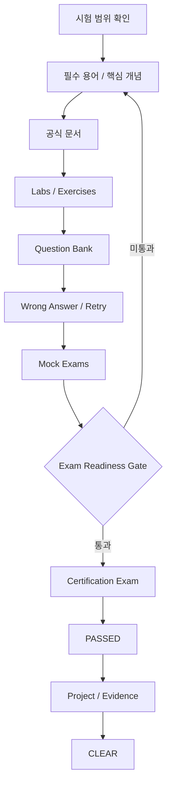
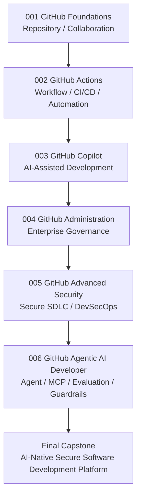

<div align="center">

# GitHub Certification Learning System

### GitHub 자격증 6종 통합 학습 · 실습 · 시험 · Evidence · Portfolio 시스템

**기초 → 자동화 → AI 활용 → 운영 → 보안 → Agentic AI**


[**Start Here**](./000-start-here/) · [**Master Dashboard**](./950-progress/) · [**6-Week Fast Track**](./950-progress/020-fast-track-dashboard.md) · [**Question Bank**](./910-question-bank/) · [**Mock Exams**](./930-mock-exams/) · [**Portfolio**](./980-portfolio/)

</div>

---

## 현재 시스템 상태

> **Repository Content & Control Tower Phase: COMPLETE**  
> 콘텐츠 구축 완료와 실제 학습 완료는 구분합니다. 현재 실제 학습 시작점은 **001 GitHub Foundations — READY**입니다.

| 영역 | 상태 | 의미 |
|---|---|---|
| Certification Content | **6 / 6 CONTENT-READY** | 001–006 학습 콘텐츠 구축 완료 |
| Shared Control Tower | **COMPLETE** | 900–980 통합 운영 영역 구축 완료 |
| System Verification | **PASS** | 과정 구조와 Control Tower 검증 완료 |
| Actual Learning | **READY** | Foundations부터 실제 학습 시작 가능 |

## Quick Start

| 단계 | 바로가기 | 수행 내용 |
|---:|---|---|
| 001 | [Start Here](./000-start-here/) | 전체 구조·학습 원칙·검증 상태 확인 |
| 002 | [Master Progress](./950-progress/) | 현재 학습 상태와 다음 행동 확인 |
| 003 | [Foundations](./001-foundations/) | 첫 실제 학습 과정 시작 |
| 004 | [Question Bank](./910-question-bank/) | 6개 과정 문제은행 통합 탐색 |
| 005 | [Mock Exams](./930-mock-exams/) | 모의고사와 Exam Gate 관리 |
| 006 | [Portfolio](./980-portfolio/) | 과정별 Evidence와 최종 Capstone 연결 |

```text
실제 학습 시작
001 Foundations
      ↓
Terms / Concepts / Official Docs
      ↓
Labs / Exercises
      ↓
Question Bank
      ↓
Wrong Answer / Retry
      ↓
Mock Exams
      ↓
Exam Readiness Gate
      ↓
PASSED
      ↓
Project / Evidence
      ↓
CLEAR
```

---

# Certification Roadmap

| 코드 | 자격증 | 시험 | Content | Learning | 바로가기 |
|---:|---|---|---|---|---|
| **001** | GitHub Foundations | GH-900 | ✅ CONTENT-READY | **READY** | [과정 시작](./001-foundations/) |
| **002** | GitHub Actions | GH-200 | ✅ CONTENT-READY | PLANNED | [과정 보기](./002-actions/) |
| **003** | GitHub Copilot | GH-300 | ✅ CONTENT-READY | PLANNED | [과정 보기](./003-copilot/) |
| **004** | GitHub Administration | GH-100 | ✅ CONTENT-READY | PLANNED | [과정 보기](./004-administration/) |
| **005** | GitHub Advanced Security | GH-500 | ✅ CONTENT-READY | PLANNED | [과정 보기](./005-advanced-security/) |
| **006** | GitHub Agentic AI Developer | GH-600 | ✅ CONTENT-READY | PLANNED | [과정 보기](./006-agentic-ai-developer/) |

### 장기 역량 순서

```text
001 Foundations
      ↓
002 Actions
      ↓
003 Copilot
      ↓
004 Administration
      ↓
005 Advanced Security
      ↓
006 Agentic AI Developer
```

### 6주 Fast Track

```text
Week 1  Foundations
   ↓
Week 2  Copilot
   ↓
Week 3  Actions
   ↓
Week 4  Administration
   ↓
Week 5  Advanced Security
   ↓
Week 6  Agentic AI Developer
```

[Fast Track Dashboard →](./950-progress/020-fast-track-dashboard.md)

---

# System Control Tower

| 코드 | 시스템 | 핵심 역할 | 바로가기 |
|---:|---|---|---|
| **900** | Glossary | 6개 과정 통합 용어·약어·교차 개념 | [열기](./900-glossary/) |
| **910** | Question Bank | **600문항** 통합 문제은행 Index | [열기](./910-question-bank/) |
| **920** | Wrong Answers | Error Code·+1일/+7일 Retry 관리 | [열기](./920-wrong-answers/) |
| **930** | Mock Exams | **18회 / 720문항** Mock·Exam Gate | [열기](./930-mock-exams/) |
| **940** | Labs | 과정별 Lab·Challenge·Verify 표준 | [열기](./940-labs/) |
| **950** | Progress | Master Dashboard·Fast Track·시험 계획 | [열기](./950-progress/) |
| **960** | Resources | 공식 자료·Source Map·Freshness 관리 | [열기](./960-resources/) |
| **970** | Certificates | 실제 시험 결과·Credential 기록 | [열기](./970-certificates/) |
| **980** | Portfolio | 과정별 프로젝트·Evidence·Final Capstone | [열기](./980-portfolio/) |

## Current Learning Content Scale

| 유형 | 현재 규모 |
|---|---:|
| Certification Courses | **6** |
| Question Bank | **600문항** |
| Mock Exam Sets | **18회** |
| Mock Questions | **720문항** |
| 자체 시험형 학습 콘텐츠 | **1,320문항** |
| Course Projects | **6개** |
| Final Capstone | **1개** |

> 모든 문제는 학습용 자체 제작 콘텐츠이며 실제 시험 유출문제·복원문제·Brain Dump를 사용하지 않습니다.

---

# Status Model

## Content Status

```text
BOOTSTRAPPED
      ↓
BUILDING
      ↓
CONTENT-READY
      ↓
MAINTENANCE
```

## Learning Status

```text
PLANNED
   ↓
READY
   ↓
LEARNING
   ↓
PRACTICING
   ↓
REVIEWING
   ↓
EXAM-READY
   ↓
PASSED
   ↓
CLEAR
```

| 상태 | 의미 |
|---|---|
| `CONTENT-READY` | Repository의 학습 자료 구축 완료 |
| `EXAM-READY` | 실제 학습자가 준비도 Gate 통과 |
| `PASSED` | 실제 자격시험 합격 |
| `CLEAR` | 시험 + 핵심 Lab + Project + Evidence 완료 |

---

# Learning Architecture



## Standard Internal Course Structure

각 자격증은 동일한 **3자리 번호 구조**를 사용합니다.

```text
010 Overview
020 Terms
030 Concepts
040 Official Docs
050 Guides
060 Labs
070 Exercises
080 Question Bank
090 Final Review
100 Projects
110 Mock Exams
120 Wrong Answers
130 Progress
140 Resources
150 Evidence
```

---

# Exam Readiness Gate

각 과정의 `130-progress/` 세부 기준이 최우선입니다. 통합 기준은 다음과 같습니다.

| 항목 | 기준 |
|---|---:|
| 공식 Study Guide 최신 범위 확인 | 100% |
| 핵심 용어 설명 | 90%+ |
| 핵심 실습 | 80%+ |
| Question Bank 2회차 | 85%+ |
| 최근 오답 Retry | 90%+ |
| Minimum Mock Gate | 최근 2회 85%+ |
| Conservative Gate | Mock 01·02·Final 모두 85%+ |
| Final Mock 권장 | 90%+ |
| 대표 Project | 80점+ 권장 |

[Exam Readiness Policy →](./930-mock-exams/090-exam-readiness-policy.md)

---

# Repository Map

```text
github-certification-learning-system/
│
├── 000-start-here/              시작·Roadmap·Verification
│
├── 001-foundations/             GH-900
├── 002-actions/                 GH-200
├── 003-copilot/                 GH-300
├── 004-administration/          GH-100
├── 005-advanced-security/       GH-500
├── 006-agentic-ai-developer/    GH-600
│
├── 900-glossary/                통합 용어집
├── 910-question-bank/           통합 문제은행
├── 920-wrong-answers/           통합 오답·Retry
├── 930-mock-exams/              통합 Mock·Gate
├── 940-labs/                    통합 Lab Index
├── 950-progress/                Master Dashboard
├── 960-resources/               공식 자료 Index
├── 970-certificates/            자격증 취득 기록
├── 980-portfolio/               Portfolio / Capstone
└── 990-archive/                 Archive
```

---

# Portfolio Growth Path

단계가 많아져도 글자가 작아지지 않도록 **세로형(Top → Down)**으로 구성했습니다.



[Portfolio Map →](./980-portfolio/010-portfolio-map.md) · [Evidence Matrix →](./980-portfolio/020-evidence-matrix.md) · [Final Capstone →](./980-portfolio/090-final-capstone.md)

---

# 운영 원칙

- 모든 주요 디렉터리와 문서는 **3자리 번호 체계**를 사용합니다.
- 핵심 기술 용어는 **English Full Name + 한국어 뜻**을 함께 표기합니다.
- 공식 문서는 복제하지 않고 **링크 + 핵심 요약 + 시험 포인트 + 관련 Lab**을 관리합니다.
- 실제 시험 유출문제·복원문제·Brain Dump를 사용하지 않습니다.
- `PASSED`와 `CLEAR`를 구분합니다.
- 실제 학습 결과가 없는 항목을 임의로 완료 처리하지 않습니다.
- Lab과 Project는 재현 가능한 Evidence를 남깁니다.
- GitHub 기능 및 시험 범위는 **학습 시작 → 예약 전 → 응시 직전**에 공식 Study Guide로 재검증합니다.

---

# Verification

| 검증 | 결과 | 문서 |
|---|---|---|
| 001–006 Course Content | **PASS** | [System Verification](./000-start-here/090-system-verification.md) |
| 900–980 Control Tower | **PASS** | [Control Tower Verification](./000-start-here/095-control-tower-verification.md) |

## Current Phase

```text
001–006 Certification Content   COMPLETE
900–980 Shared Control Tower    COMPLETE
Repository System Verification PASS

NEXT
→ 001 Foundations 실제 학습 시작
→ Study Session / Score / Evidence 기록
→ GH-900 Exam Readiness Gate
```

<div align="center">

### Next: [001 GitHub Foundations 시작 →](./001-foundations/)

[Start Here](./000-start-here/) · [Progress](./950-progress/) · [Fast Track](./950-progress/020-fast-track-dashboard.md) · [Portfolio](./980-portfolio/)

</div>
