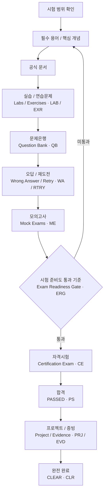
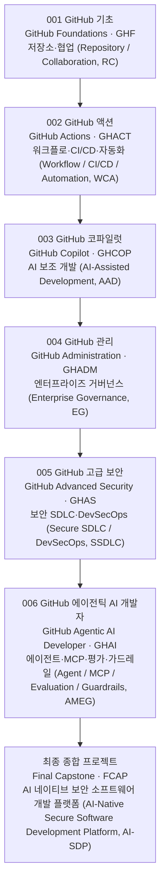

<div align="center">

# GitHub 자격증 통합 학습 시스템 (GitHub Certification Learning System, GCLS)

### GitHub 자격증 6종 통합 학습 · 실습 · 시험 · 증빙 (Evidence, EVD) · 포트폴리오 (Portfolio, PTF) 시스템

**기초 → 자동화 → AI 활용 → 운영 → 보안 → 에이전틱 AI (Agentic AI, AAI)**


[**시작 안내 (Start Here, SH)**](./000-start-here/) · [**통합 대시보드 (Master Dashboard, MD)**](./950-progress/) · [**6주 단기 집중 과정 (6-Week Fast Track, 6WFT)**](./950-progress/020-fast-track-dashboard.md) · [**문제은행 (Question Bank, QB)**](./910-question-bank/) · [**모의고사 (Mock Exams, ME)**](./930-mock-exams/) · [**포트폴리오 (Portfolio, PTF)**](./980-portfolio/)

</div>

---

## 현재 시스템 상태 (Current System Status, CSS)

> **저장소 콘텐츠 및 통합 관제 단계 (Repository Content & Control Tower Phase, RCCTP): COMPLETE**  
> 콘텐츠 구축 완료와 실제 학습 완료는 구분합니다. 현재 실제 학습 시작점은 **001 GitHub 기초 (GitHub Foundations, GHF) — READY**입니다.

| 영역 | 상태 | 의미 |
|---|---|---|
| 자격증 콘텐츠 (Certification Content, CC) | **6 / 6 CONTENT-READY** | 001–006 학습 콘텐츠 구축 완료 |
| 공통 통합 관제 (Shared Control Tower, SCT) | **COMPLETE** | 900–980 통합 운영 영역 구축 완료 |
| 시스템 검증 (System Verification, SV) | **PASS** | 과정 구조와 Control Tower 검증 완료 |
| 실제 학습 (Actual Learning, AL) | **READY** | Foundations부터 실제 학습 시작 가능 |

## 빠른 시작 (Quick Start, QS)

| 단계 | 바로가기 | 수행 내용 |
|---:|---|---|
| 001 | [시작 안내 (Start Here, SH)](./000-start-here/) | 전체 구조·학습 원칙·검증 상태 확인 |
| 002 | [통합 진행 현황 (Master Progress, MP)](./950-progress/) | 현재 학습 상태와 다음 행동 확인 |
| 003 | [GitHub 기초 (GitHub Foundations, GHF)](./001-foundations/) | 첫 실제 학습 과정 시작 |
| 004 | [문제은행 (Question Bank, QB)](./910-question-bank/) | 6개 과정 문제은행 통합 탐색 |
| 005 | [모의고사 (Mock Exams, ME)](./930-mock-exams/) | 모의고사와 시험 준비도 통과 기준 관리 |
| 006 | [포트폴리오 (Portfolio, PTF)](./980-portfolio/) | 과정별 증빙과 최종 종합 프로젝트 연결 |

```text
실제 학습 시작
001 GitHub 기초 (GitHub Foundations, GHF)
      ↓
용어 / 개념 / 공식 문서 (Terms / Concepts / Official Docs, TRM / CPT / ODC)
      ↓
실습 / 연습문제 (Labs / Exercises, LAB / EXR)
      ↓
문제은행 (Question Bank, QB)
      ↓
오답 / 재도전 (Wrong Answer / Retry, WA / RTRY)
      ↓
모의고사 (Mock Exams, ME)
      ↓
시험 준비도 통과 기준 (Exam Readiness Gate, ERG)
      ↓
합격 (PASSED, PS)
      ↓
프로젝트 / 증빙 (Project / Evidence, PRJ / EVD)
      ↓
완전 완료 (CLEAR, CLR)
```

---

# 자격증 로드맵 (Certification Roadmap, CR)

| 코드 | 자격증 | 시험 | 콘텐츠 (Content, CNT) | 학습 (Learning, LRN) | 바로가기 |
|---:|---|---|---|---|---|
| **001** | GitHub 기초 (GitHub Foundations, GHF / GH-900) | GH-900 | ✅ CONTENT-READY | **READY** | [과정 시작](./001-foundations/) |
| **002** | GitHub 액션 (GitHub Actions, GHACT / GH-200) | GH-200 | ✅ CONTENT-READY | PLANNED | [과정 보기](./002-actions/) |
| **003** | GitHub 코파일럿 (GitHub Copilot, GHCOP / GH-300) | GH-300 | ✅ CONTENT-READY | PLANNED | [과정 보기](./003-copilot/) |
| **004** | GitHub 관리 (GitHub Administration, GHADM / GH-100) | GH-100 | ✅ CONTENT-READY | PLANNED | [과정 보기](./004-administration/) |
| **005** | GitHub 고급 보안 (GitHub Advanced Security, GHAS / GH-500) | GH-500 | ✅ CONTENT-READY | PLANNED | [과정 보기](./005-advanced-security/) |
| **006** | GitHub 에이전틱 AI 개발자 (GitHub Agentic AI Developer, GHAI / GH-600) | GH-600 | ✅ CONTENT-READY | PLANNED | [과정 보기](./006-agentic-ai-developer/) |

### 장기 역량 순서 (Long-Term Capability Order, LTCO)

```text
001 GitHub 기초 (GitHub Foundations, GHF)
      ↓
002 GitHub 액션 (GitHub Actions, GHACT)
      ↓
003 GitHub 코파일럿 (GitHub Copilot, GHCOP)
      ↓
004 GitHub 관리 (GitHub Administration, GHADM)
      ↓
005 GitHub 고급 보안 (GitHub Advanced Security, GHAS)
      ↓
006 GitHub 에이전틱 AI 개발자 (GitHub Agentic AI Developer, GHAI)
```

### 6주 단기 집중 과정 (6-Week Fast Track, 6WFT)

```text
1주차 (Week 1)  GitHub 기초 (Foundations, GHF)
   ↓
2주차 (Week 2)  GitHub 코파일럿 (Copilot, GHCOP)
   ↓
3주차 (Week 3)  GitHub 액션 (Actions, GHACT)
   ↓
4주차 (Week 4)  GitHub 관리 (Administration, GHADM)
   ↓
5주차 (Week 5)  GitHub 고급 보안 (Advanced Security, GHAS)
   ↓
6주차 (Week 6)  GitHub 에이전틱 AI 개발자 (Agentic AI Developer, GHAI)
```

[단기 집중 과정 대시보드 (Fast Track Dashboard, FTD) →](./950-progress/020-fast-track-dashboard.md)

---

# 시스템 통합 관제 (System Control Tower, SCT)

| 코드 | 시스템 | 핵심 역할 | 바로가기 |
|---:|---|---|---|
| **900** | 통합 용어집 (Glossary, GLS) | 6개 과정 통합 용어·약어·교차 개념 | [열기](./900-glossary/) |
| **910** | 문제은행 (Question Bank, QB) | **600문항** 통합 문제은행 인덱스 (Index, IDX) | [열기](./910-question-bank/) |
| **920** | 오답 관리 (Wrong Answers, WA) | 오류 코드 (Error Code, EC)·+1일/+7일 재도전 관리 | [열기](./920-wrong-answers/) |
| **930** | 모의고사 (Mock Exams, ME) | **18회 / 720문항** 모의고사·시험 준비도 통과 기준 | [열기](./930-mock-exams/) |
| **940** | 실습 (Labs, LAB) | 과정별 실습·도전 과제·검증 표준 | [열기](./940-labs/) |
| **950** | 진행 현황 (Progress, PRG) | 통합 대시보드·단기 집중 과정·시험 계획 | [열기](./950-progress/) |
| **960** | 자료 (Resources, RES) | 공식 자료·출처 맵 (Source Map, SM)·최신성 (Freshness, FRH) 관리 | [열기](./960-resources/) |
| **970** | 자격증 기록 (Certificates, CERT) | 실제 시험 결과·자격 증명 (Credential, CRED) 기록 | [열기](./970-certificates/) |
| **980** | 포트폴리오 (Portfolio, PTF) | 과정별 프로젝트·증빙·최종 종합 프로젝트 | [열기](./980-portfolio/) |

## 현재 학습 콘텐츠 규모 (Current Learning Content Scale, CLCS)

| 유형 | 현재 규모 |
|---|---:|
| 자격증 과정 (Certification Courses, CC) | **6** |
| 문제은행 (Question Bank, QB) | **600문항** |
| 모의고사 세트 (Mock Exam Sets, MES) | **18회** |
| 모의고사 문항 (Mock Questions, MQ) | **720문항** |
| 자체 시험형 학습 콘텐츠 | **1,320문항** |
| 과정 프로젝트 (Course Projects, CP) | **6개** |
| 최종 종합 프로젝트 (Final Capstone, FCAP) | **1개** |

> 모든 문제는 학습용 자체 제작 콘텐츠이며 실제 시험 유출문제·복원문제·브레인 덤프 (Brain Dump, BD)를 사용하지 않습니다.

---

# 상태 모델 (Status Model, SM)

## 콘텐츠 상태 (Content Status, CS)

```text
초기 구축 (BOOTSTRAPPED, BS)
      ↓
구축 중 (BUILDING, BLD)
      ↓
콘텐츠 준비 완료 (CONTENT-READY, CR)
      ↓
유지관리 (MAINTENANCE, MNT)
```

## 학습 상태 (Learning Status, LS)

```text
계획 (PLANNED, PLN)
   ↓
준비 (READY, RDY)
   ↓
학습 중 (LEARNING, LRN)
   ↓
실습 중 (PRACTICING, PRC)
   ↓
복습 중 (REVIEWING, RVW)
   ↓
시험 준비 완료 (EXAM-READY, ER)
   ↓
합격 (PASSED, PS)
   ↓
완전 완료 (CLEAR, CLR)
```

| 상태 | 의미 |
|---|---|
| `CONTENT-READY` | 저장소 (Repository, REPO)의 학습 자료 구축 완료 |
| `EXAM-READY` | 실제 학습자가 준비도 통과 기준 (Readiness Gate, RG) 통과 |
| `PASSED` | 실제 자격시험 합격 |
| `CLEAR` | 시험 + 핵심 실습 + 프로젝트 + 증빙 완료 |

---

# 학습 아키텍처 (Learning Architecture, LA)



## 표준 과정 내부 구조 (Standard Internal Course Structure, SICS)

각 자격증은 동일한 **3자리 번호 구조**를 사용합니다.

```text
010 개요 (Overview, OVW)
020 용어 (Terms, TRM)
030 개념 (Concepts, CPT)
040 공식 문서 (Official Docs, ODC)
050 가이드 (Guides, GDE)
060 실습 (Labs, LAB)
070 연습문제 (Exercises, EXR)
080 문제은행 (Question Bank, QB)
090 최종 복습 (Final Review, FR)
100 프로젝트 (Projects, PRJ)
110 모의고사 (Mock Exams, ME)
120 오답 관리 (Wrong Answers, WA)
130 진행 현황 (Progress, PRG)
140 자료 (Resources, RES)
150 증빙 (Evidence, EVD)
```

---

# 시험 준비도 통과 기준 (Exam Readiness Gate, ERG)

각 과정의 `130-progress/` 세부 기준이 최우선입니다. 통합 기준은 다음과 같습니다.

| 항목 | 기준 |
|---|---:|
| 공식 학습 가이드 (Study Guide, SG) 최신 범위 확인 | 100% |
| 핵심 용어 설명 | 90%+ |
| 핵심 실습 | 80%+ |
| 문제은행 2회차 (Question Bank 2nd Pass, QB2) | 85%+ |
| 최근 오답 재도전 (Wrong Answer Retry, WAR) | 90%+ |
| 최소 모의고사 통과 기준 (Minimum Mock Gate, MMG) | 최근 2회 85%+ |
| 보수적 통과 기준 (Conservative Gate, CG) | Mock 01·02·Final 모두 85%+ |
| 최종 모의고사 권장 (Final Mock Recommended, FMR) | 90%+ |
| 대표 프로젝트 (Representative Project, RP) | 80점+ 권장 |

[시험 준비도 정책 (Exam Readiness Policy, ERP) →](./930-mock-exams/090-exam-readiness-policy.md)

---

# 저장소 맵 (Repository Map, RM)

```text
github-certification-learning-system/
│
├── 000-start-here/              시작 안내 (Start Here, SH) · 로드맵 (Roadmap, RM) · 검증 (Verification, VER)
│
├── 001-foundations/             GitHub 기초 (GitHub Foundations, GHF) · GH-900
├── 002-actions/                 GitHub 액션 (GitHub Actions, GHACT) · GH-200
├── 003-copilot/                 GitHub 코파일럿 (GitHub Copilot, GHCOP) · GH-300
├── 004-administration/          GitHub 관리 (GitHub Administration, GHADM) · GH-100
├── 005-advanced-security/       GitHub 고급 보안 (GitHub Advanced Security, GHAS) · GH-500
├── 006-agentic-ai-developer/    GitHub 에이전틱 AI 개발자 (GitHub Agentic AI Developer, GHAI) · GH-600
│
├── 900-glossary/                통합 용어집 (Glossary, GLS)
├── 910-question-bank/           통합 문제은행 (Question Bank, QB)
├── 920-wrong-answers/           통합 오답·재도전 (Wrong Answers / Retry, WAR)
├── 930-mock-exams/              통합 모의고사·통과 기준 (Mock / Gate, MG)
├── 940-labs/                    통합 실습 인덱스 (Lab Index, LI)
├── 950-progress/                통합 대시보드 (Master Dashboard, MD)
├── 960-resources/               공식 자료 인덱스 (Official Resource Index, ORI)
├── 970-certificates/            자격증 취득 기록 (Certificates, CERT)
├── 980-portfolio/               포트폴리오 / 종합 프로젝트 (Portfolio / Capstone, PC)
└── 990-archive/                 보관소 (Archive, ARC)
```

---

# 포트폴리오 성장 경로 (Portfolio Growth Path, PGP)

단계가 많아져도 글자가 작아지지 않도록 **세로형 (Top → Down, TD)**으로 구성했습니다.



[포트폴리오 맵 (Portfolio Map, PM) →](./980-portfolio/010-portfolio-map.md) · [증빙 매트릭스 (Evidence Matrix, EM) →](./980-portfolio/020-evidence-matrix.md) · [최종 종합 프로젝트 (Final Capstone, FCAP) →](./980-portfolio/090-final-capstone.md)

---

# 운영 원칙 (Operating Principles, OP)

- 모든 주요 디렉터리와 문서는 **3자리 번호 체계**를 사용합니다.
- 핵심 학습 용어는 **한글 (English Full Name, ABBR)** 형식을 기본으로 사용합니다.
- 공식 문서는 복제하지 않고 **링크 + 핵심 요약 + 시험 포인트 + 관련 실습 (Lab, LAB)**을 관리합니다.
- 실제 시험 유출문제·복원문제·브레인 덤프 (Brain Dump, BD)를 사용하지 않습니다.
- `PASSED`와 `CLEAR`를 구분합니다.
- 실제 학습 결과가 없는 항목을 임의로 완료 처리하지 않습니다.
- 실습 (Lab, LAB)과 프로젝트 (Project, PRJ)는 재현 가능한 증빙 (Evidence, EVD)을 남깁니다.
- GitHub 기능 및 시험 범위는 **학습 시작 → 예약 전 → 응시 직전**에 공식 학습 가이드 (Study Guide, SG)로 재검증합니다.
- 명령어·코드·파일 경로·URL·YAML/JSON 키·정확한 UI 라벨은 재현성을 위해 원문을 유지합니다.

[한글·영어·약어 표기 표준 (Korean-English-Abbreviation Notation Standard, KEA) →](./000-start-here/060-language-notation-standard.md)

---

# 검증 (Verification, VER)

| 검증 | 결과 | 문서 |
|---|---|---|
| 001–006 과정 콘텐츠 (Course Content, CC) | **PASS** | [시스템 검증 (System Verification, SV)](./000-start-here/090-system-verification.md) |
| 900–980 통합 관제 (Control Tower, CT) | **PASS** | [통합 관제 검증 (Control Tower Verification, CTV)](./000-start-here/095-control-tower-verification.md) |
| 한글·영어·약어 표기 (Korean-English-Abbreviation Notation, KEA) | **PASS** | [표기 점검 (Language Audit, LA)](./000-start-here/061-language-audit.md) |

## 현재 단계 (Current Phase, CP)

```text
001–006 자격증 콘텐츠 (Certification Content, CC)   COMPLETE
900–980 공통 통합 관제 (Shared Control Tower, SCT) COMPLETE
저장소 시스템 검증 (Repository System Verification, RSV) PASS

다음 (NEXT, NXT)
→ 001 GitHub 기초 (GitHub Foundations, GHF) 실제 학습 시작
→ 학습 세션 / 점수 / 증빙 (Study Session / Score / Evidence, SSE) 기록
→ GH-900 시험 준비도 통과 기준 (Exam Readiness Gate, ERG)
```

<div align="center">

### 다음 (Next, NXT): [001 GitHub 기초 (GitHub Foundations, GHF / GH-900) 시작 →](./001-foundations/)

[시작 안내 (Start Here, SH)](./000-start-here/) · [진행 현황 (Progress, PRG)](./950-progress/) · [단기 집중 과정 (Fast Track, FT)](./950-progress/020-fast-track-dashboard.md) · [포트폴리오 (Portfolio, PTF)](./980-portfolio/)

</div>
